# 🎓 Academo – Online Learning Platform

A modern, cross-platform online learning application built with **Flutter**, designed to deliver an intuitive and engaging educational experience with course browsing, video lessons, progress tracking, and seamless purchases.

---

## 📱 Features

### Core Features
- **Course Catalog** – Browse and discover courses across multiple categories
- **Video Learning** – High-quality video lessons with a custom player
- **Progress Tracking** – Monitor learning progress with detailed metrics
- **My Learning** – Access enrolled courses anytime
- **Favorites** – Save courses for later
- **Purchases** – Smooth course purchase flow with history tracking

---

### User Management
- **Authentication** – Sign up, login, and password recovery
- **Profile Management** – Manage personal information
- **Settings** – Customize the app experience

---

### Support & Legal
- **Help Center** – Frequently asked questions
- **Report Issues** – In-app issue reporting
- **Legal Pages** – Terms of service & privacy policy

---

## 🎨 Design System

- **Design Language**: Material 3
- **Typography**: Inter (Google Fonts)
- **Theme**: Automatic Light / Dark mode
- **Navigation**: Bottom navigation with smooth transitions
- **Responsive**: Optimized for mobile & web

---

## 🛠️ Technologies

- **Flutter** (3.32.2+)
- **Navigation**: go_router (v16.2.0)
- **State Management**: Provider
- **Architecture**: Clean architecture (services + providers)
- **Storage**: Local storage (ready for backend integration)

---

## 📁 Project Structure

```

lib/
├── main.dart
├── nav.dart
├── theme.dart
├── models/
├── services/
├── providers/
├── pages/
│   ├── auth/
│   ├── home/
│   ├── browse/
│   ├── course/
│   ├── video/
│   ├── my_courses/
│   ├── favorites/
│   ├── purchase/
│   ├── profile/
│   ├── settings/
│   ├── support/
│   └── legal/
├── widgets/
└── utils/

````

---

## 📸 Screenshots

### 🔐 Authentication
<p float="center">
  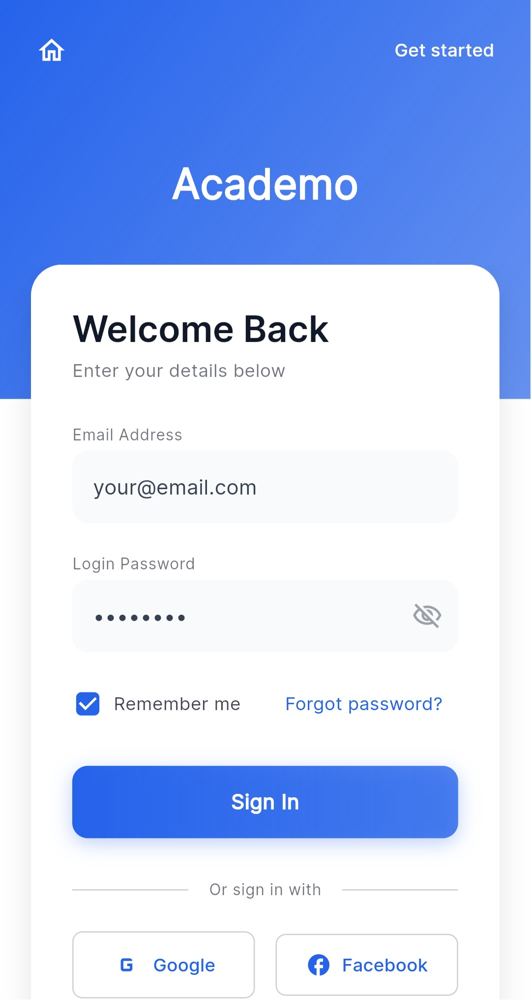
  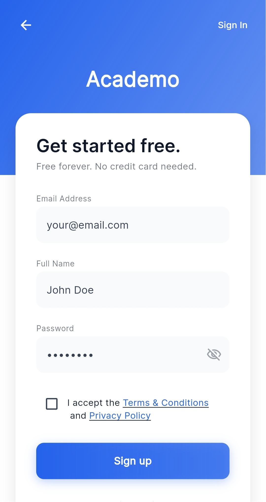
</p>

---

### 🏠 Home (Light & Dark Mode)
<p float="center">
  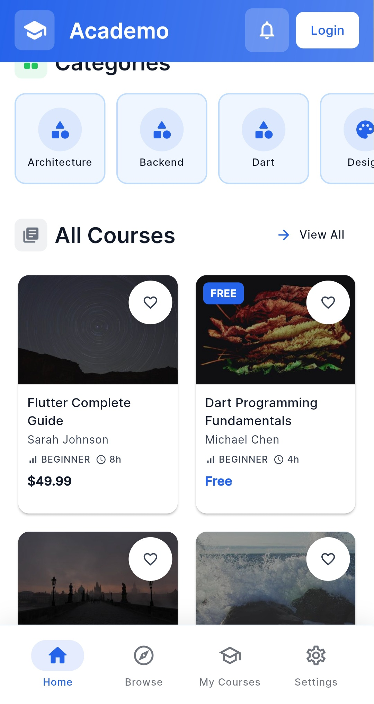
  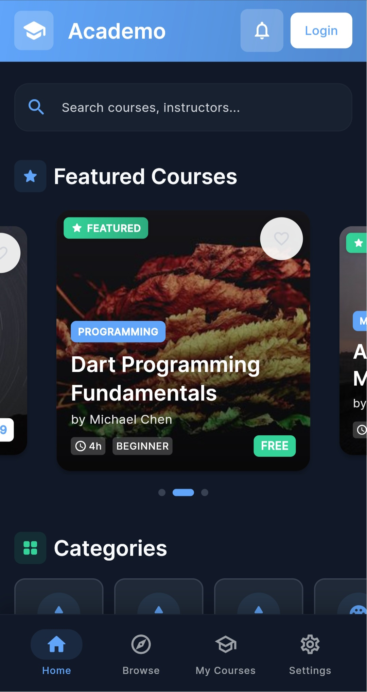
</p>

---

### 📚 Courses
<p float="center">
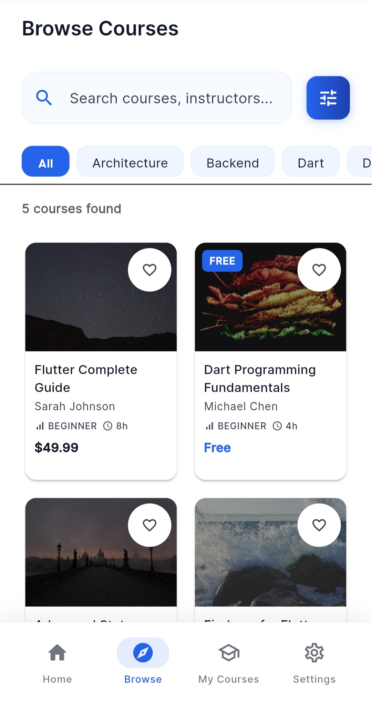
</p>
---

### 📘 Course Details
<p float="center">
  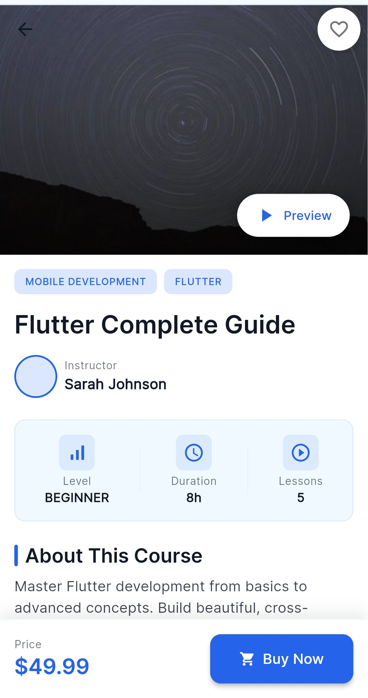
  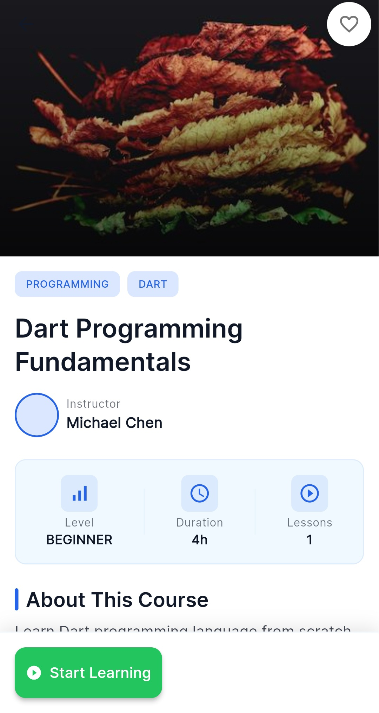
</p>

---

### 🎯 My Learning
<p float="center">
  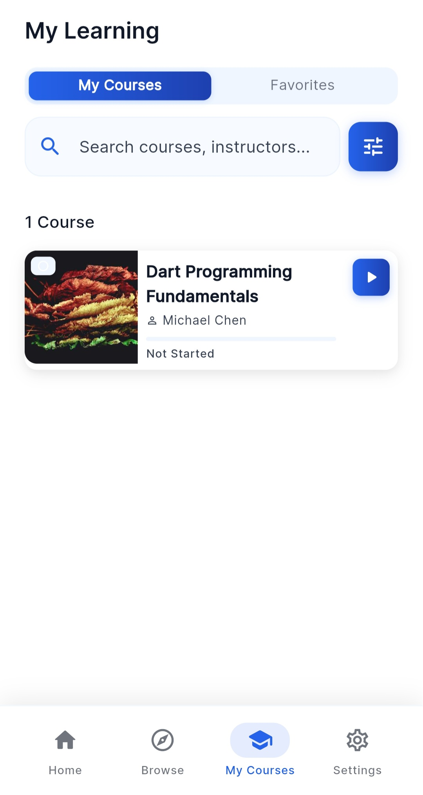
  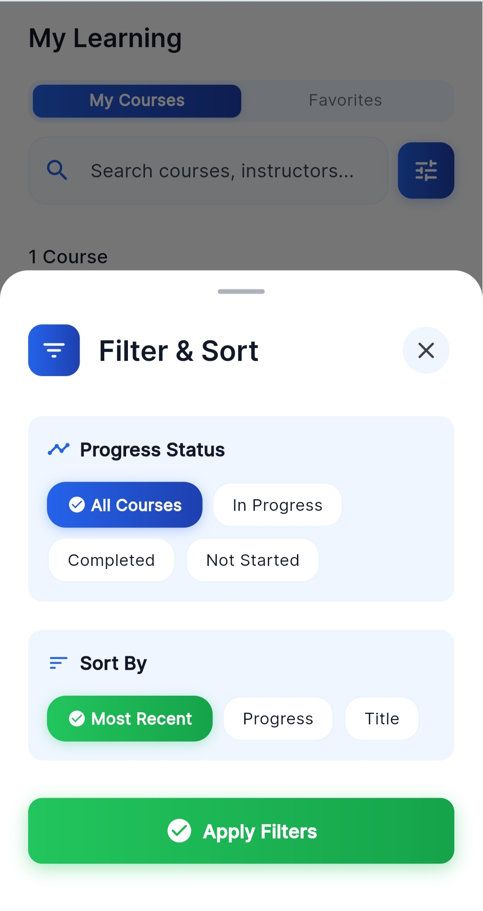
  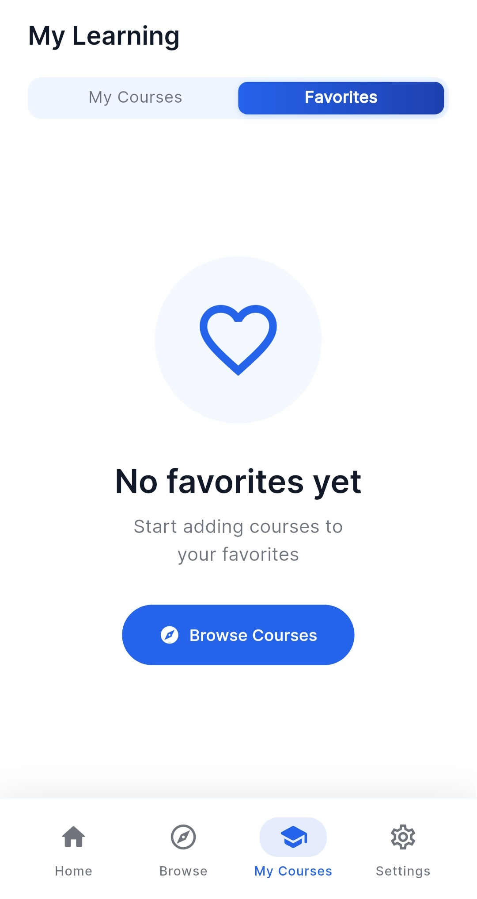
</p>

---

### ⚙️ Settings
<p float="center">
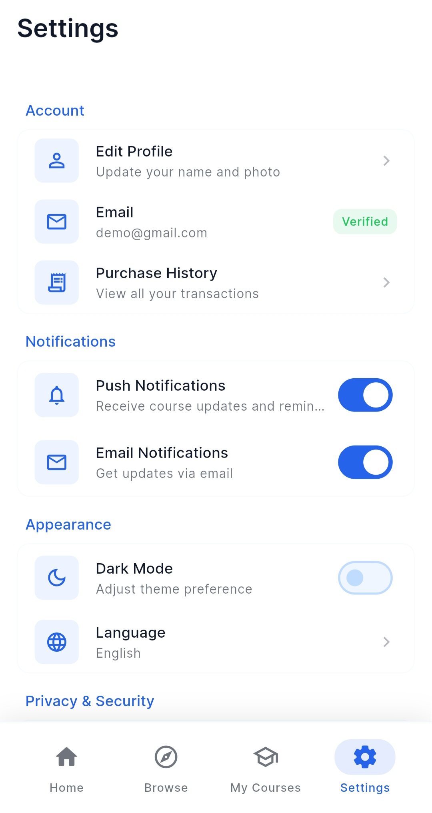
</p>
---

## 🚀 Getting Started

### Prerequisites
- Flutter SDK (3.32.2+)
- Dart SDK
- IDE (VS Code, Android Studio, or Dreamflow)

---

### Installation

```bash
git clone https://github.com/Hamza-Maa/Academo-Online-Learning-Platform.git
cd academo
flutter pub get
flutter run
````

---

### Platform Support

* **Android** ✅
* **iOS** ✅
* **Web** ✅

---

## 🏗️ Architecture Overview

### Navigation

* Declarative routing using **go_router**
* Routes defined in `lib/nav.dart`
* Navigation via `context.go()` and `context.push()`

### State Management

* Provider-based global state
* Separate providers for auth, courses, and progress
* Business logic handled in services

---

## 🧪 Testing

```bash
flutter test
flutter test --coverage
```

---

## 🔒 Backend Integration

Currently uses local sample data.
Architecture is ready for:

* **Firebase**
* **Supabase**

Services can be easily switched to cloud-based backends.

---

## 🤝 Contributing

Contributions are welcome!

1. Fork the repository
2. Create a feature branch
3. Commit your changes
4. Push to your branch
5. Open a Pull Request

---

## 📄 License

MIT License

---

## 👨‍💻 Author

Built with ❤️ using **Flutter**

📧 **Contact**: [hamza.maatougui@outlook.com](mailto:hamza.maatougui@outlook.com)

---

**Happy Learning 📚✨**